# Commit-Relay

**Multi-agent AI system for autonomous GitHub repository management.**

[](https://github.com/ry-ops/commit-relay)
[](./docs/master-worker-architecture.md)
[](./LICENSE)

> **Note:** This project is archived and no longer in active development or production use. The codebase is preserved as-is for reference.

---

## What is Commit-Relay?

Commit-Relay was an autonomous multi-agent platform that managed the entire GitHub repository lifecycle — from task routing to code implementation, security scanning, testing, and deployment — with zero manual intervention.

Agents communicated through structured coordination files rather than direct API calls, creating a fully auditable, transparent orchestration system. A central Coordinator routed incoming tasks to specialized master agents using a Mixture of Experts (MoE) router, which then spawned lightweight workers to execute in parallel.

---

## Architecture

<p align="center">
  
</p>

### Core Components

| Component | Description |
|-----------|-------------|
| **5 Master Agents** | Coordinator, Development, Security, Inventory, CI/CD |
| **7 Worker Types** | Implementation, Fix, Test, Scan, Security Fix, Documentation, Analysis |
| **8+ Autonomous Daemons** | Coordinator, Worker Manager, Process Monitor, Heartbeat, Zombie Cleanup, Worker Restart, Failure Detection, Auto-Fix |
| **LLM Mesh Gateway** | Multi-provider support (Anthropic, OpenAI, Ollama) with circuit breakers, cost tracking, and automatic failover |
| **MoE Router v4.0** | 350+ activation keywords, learned weights, semantic routing, 100% routing confidence |
| **RAG System** | FAISS vector store with 5 collections (code, docs, decisions, patterns, tasks) using sentence-transformers |
| **API Server** | 128 REST endpoints, WebSocket streaming, rate limiting, authentication |
| **MCP Server** | Model Context Protocol interface exposing system capabilities as tools |
| **Python SDK** | Full client library with task orchestration, analytics, health monitoring, and reporting |
| **Observability** | Elastic APM, LangSmith tracing, 27 event types, distributed tracing, anomaly detection |

<p align="center">
  
</p>

---

## Key Capabilities

### Intelligent Task Routing
- Mixture of Experts router with 350+ keywords and continuous learning
- PyTorch neural routing with training pipeline
- Semantic routing via embeddings (94.5% coverage)
- Margin-based confidence with automatic fallback

### Self-Healing System
- 12+ automated remediation strategies
- Heartbeat monitoring with 2-minute intervals
- Zombie worker detection and cleanup
- Exponential backoff restart logic
- ML-based failure pattern recognition

### LLM Mesh (Multi-Provider Gateway)
- Anthropic Claude (primary), OpenAI, and Ollama support
- Cost-aware model selection (simple tasks -> haiku, complex -> opus)
- Circuit breaker middleware with provider health monitoring
- Automatic failover chains with retries
- Token usage and cost analytics

### Enterprise Governance
- PII scanning (emails, phone numbers, SSNs, API keys)
- RBAC with permission inheritance across 7 namespaces
- SOC2, GDPR, HIPAA compliance policy checking
- Data quality monitoring with schema validation
- Complete audit trail via file-based coordination

### Observability Stack
- Elastic Cloud APM with custom spans and business metrics
- LangSmith for LLM performance tracking
- 27 event types with real-time streaming
- Distributed tracing with waterfall visualization
- 50+ system metrics with aggregation

### RAG-Enhanced Context
- Pluggable vector store (Weaviate, Qdrant, file-based)
- Connectors for GitHub, Confluence, Slack
- Hybrid search (BM25 + semantic with Reciprocal Rank Fusion)
- 5 specialized collections with metadata schemas

---

## Project Structure

```
commit-relay/
├── agents/              # Agent configs, prompts, logs, worker outputs
├── api-server/          # Express.js API server (128 endpoints)
├── config/              # System configuration
├── coordination/        # File-based coordination (task queue, worker pool, handoffs)
│   ├── masters/         # Master agent configurations and libraries
│   ├── governance/      # Governance policies and audit logs
│   ├── catalog/         # Data and AI catalog
│   └── observability/   # Event streams and metrics
├── docs/                # 40+ documentation files
├── examples/            # Usage examples
├── lib/                 # Shared libraries
│   ├── cache/           # Adaptive LRU cache
│   ├── governance/      # PII scanner, access control, compliance
│   ├── orchestration/   # Workflow engine, SLA monitor, rate limiter
│   └── rag/             # Vector store, embeddings, connectors
├── llm-mesh/            # Multi-provider LLM gateway
├── mcp-server/          # Model Context Protocol server
├── python-sdk/          # Python client library
├── scripts/             # 117+ operational scripts
├── security/            # Security scanning and CVE tracking
└── testing/             # Test suites and test utilities
```

---

## Tech Stack

| Category | Technologies |
|----------|-------------|
| **Runtime** | Node.js 18+, Python 3.8+, Bash |
| **AI/ML** | Anthropic Claude, OpenAI, Ollama, PyTorch, sentence-transformers, FAISS |
| **API** | Express.js 5, WebSocket, JSON-RPC 2.0 (MCP) |
| **Observability** | Elastic APM, LangSmith, OpenTelemetry |
| **Security** | Helmet, express-rate-limit, JWT, PII scanning |
| **Data** | FAISS, Weaviate, Qdrant, MiniSearch |
| **Deployment** | Docker, systemd/launchd |

---

## License

[MIT](./LICENSE)
